# Electava General Site And Workspace Flow

## Purpose

This document describes the full Electava website and workspace at a business-flow level. It avoids code and file references and focuses only on pages, user journeys, roles, and how each part of the system connects. It is meant to help create general flowcharts for every page.

## Full System View

Electava has two main sides:

- Public Site
  Used by customers, buyers, sellers, applicants, and general visitors
- Internal Workspace
  Used by internal operations teams and role-based users

The public site is where people discover products, request quotations, contact the team, apply for careers, and start business interactions.

The workspace is where internal users manage components, vendors, service requests, approvals, reports, and operations.

## Top-Level Flow

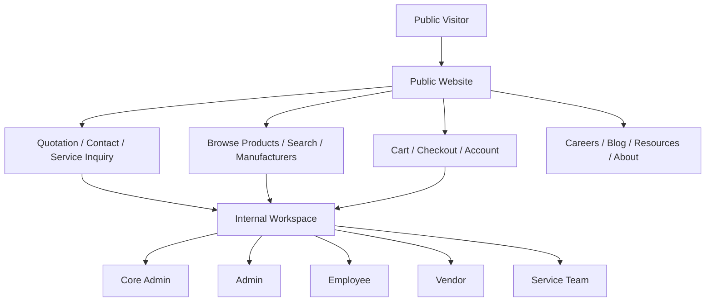

## Public Site Flow

### Main Public Areas

The public side currently includes these page groups:

- Home / landing
- Products
- Product detail
- Manufacturers
- Search
- Quotation request
- Contact
- Sell / seller entry
- Blog
- Careers
- Resources
- About
- Account
- Login
- Register
- Forgot password
- Cart
- Checkout

### Public Site Page Map

| Page Group | Main Purpose | Typical Next Step |
|---|---|---|
| Home | Entry point to the Electava brand and marketplace | Products, quotation, contact, careers, resources |
| Products | Browse available marketplace products | Product detail, cart, quotation |
| Product Detail | Review one product fully | Add to cart, request quote, continue browsing |
| Manufacturers | Explore brands and product sources | Manufacturer-based product browsing |
| Search | Find products quickly | Product detail, products, quotation |
| Quotation | Request pricing or project support | Internal review and service handling |
| Contact | Send general inquiries | Internal follow-up |
| Sell / Seller | Start a seller or sourcing relationship | Internal follow-up or vendor path |
| Blog | Read company/product content | Blog detail, products, careers, contact |
| Careers | Review open roles and apply | Career application flow |
| Resources | Read helpful company/resource content | Contact, quotation, products |
| About | Learn about Electava | Products, contact, careers |
| Account | Manage customer account area | Orders, account actions, checkout support |
| Login / Register | Access or create user identity | Account, checkout, saved actions |
| Cart | Review selected products | Checkout |
| Checkout | Finish buying/request process | Order or inquiry completion |

### Public Website General Journey

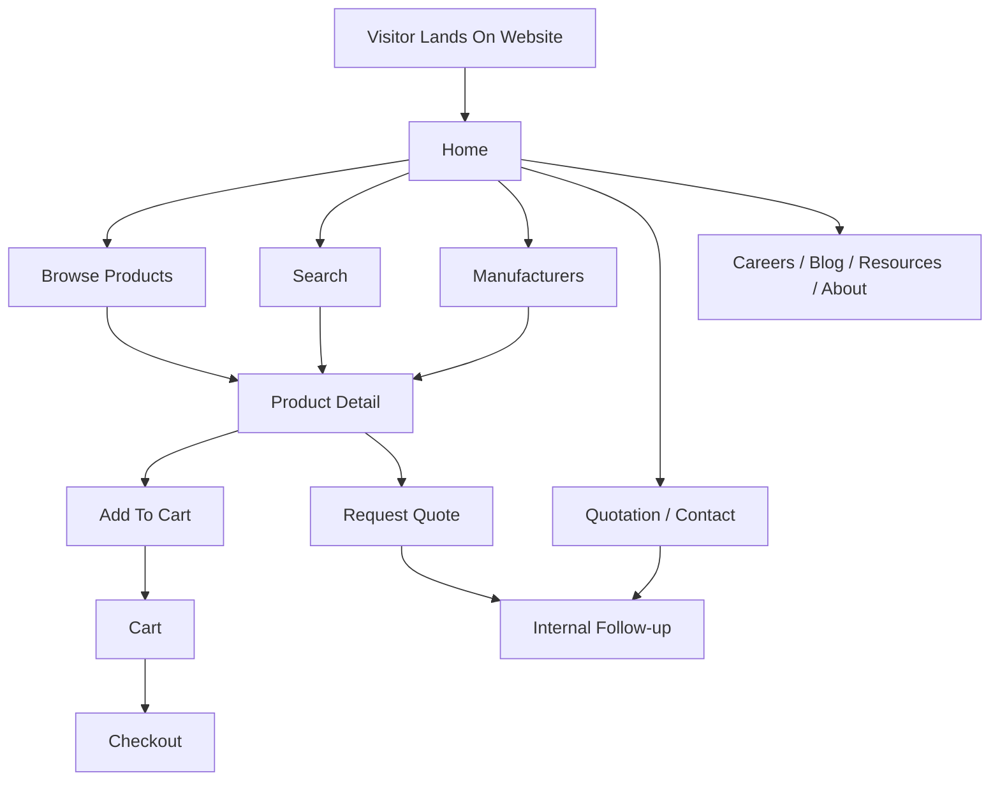

## Workspace Flow

### Workspace Entry

All internal users start from one workspace login and then are routed based on their role.

Current internal role groups:

- Core Admin
- Admin
- Employee
- Vendor
- Service Team

### Workspace Role Routing

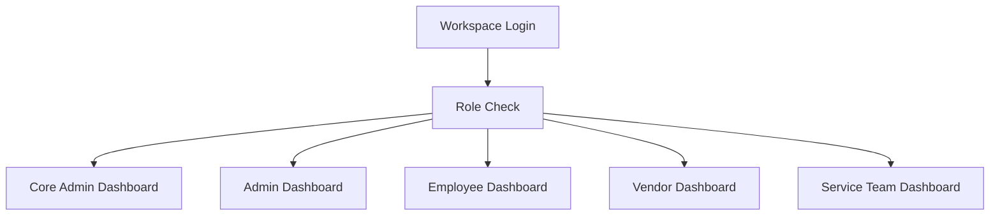

## Core Admin Flow

### Core Admin Main Responsibilities

- manage users and internal roles
- manage service team access
- manage projects and domains
- monitor marketplace users and tracking
- monitor service tokens
- manage careers
- manage permissions and settings
- review system reports and logs

### Core Admin Page Flow

| Page Group | Purpose | Typical Next Step |
|---|---|---|
| Dashboard | High-level system overview | Employees, projects, reports, service tokens |
| Employees | Create and manage user accounts and roles | View employee details, create service team login |
| Projects | Track internal projects | Review assignments and status |
| Domains | Manage domain access structure | Update user/domain mapping |
| Task Templates | Define reusable work patterns | Team execution |
| Users | Review marketplace user activity | Service tokens or tracking review |
| Service Tokens | Review incoming marketplace service requests | Reply, reassign, track follow-up |
| Careers | Manage career entries | Keep public career page updated |
| Reports | View operational reporting | Investigate issues or trends |
| Audit Logs | Review internal actions | Compliance and review |
| Login Logs | Review user access activity | Security review |
| Marketplace Tracking | Review marketplace usage activity | Product or funnel decisions |
| Permissions | Manage module access | User enablement |
| Settings | Manage system-wide behavior | Platform configuration |

### Core Admin General Flow

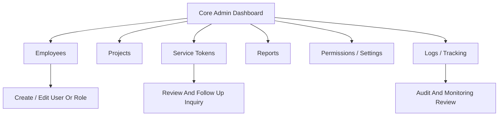

## Admin Flow

### Admin Main Responsibilities

- manage operational team work
- manage tasks
- review approvals
- monitor team output
- coordinate vendors
- review reports

### Admin Page Flow

| Page Group | Purpose | Typical Next Step |
|---|---|---|
| Dashboard | Team-level overview | Tasks, approvals, team, reports |
| Tasks | Create and monitor work | Assign to employee |
| Approvals | Review submitted work | Approve or reject |
| Team | Monitor team capacity | Reassign or guide work |
| Vendors | View vendor-related operations | Coordinate product or sourcing work |
| Reports | Review performance and workload | Operational action |

## Employee Flow

### Employee Main Responsibilities

- work on assigned tasks
- submit work
- manage components
- manage employee-side service requests where applicable

### Employee Page Flow

| Page Group | Purpose | Typical Next Step |
|---|---|---|
| Dashboard | Daily work entry point | Tasks, submissions, components, services |
| Tasks | Work on assigned tasks | Submit progress |
| Submissions | Review submitted items | Track approval outcome |
| Components | Create and manage component entries | Save draft, create next, submit for approval |
| Services | Handle assigned service work if applicable | Update status and notes |

### Employee Component Lifecycle

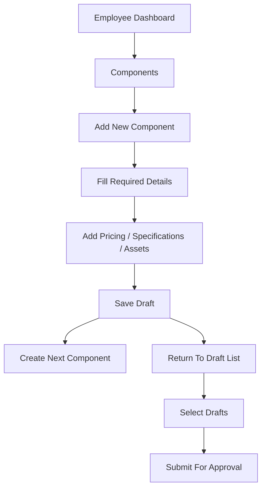

## Vendor Flow

### Vendor Main Responsibilities

- add products
- bulk upload products
- manage inventory
- review purchase orders
- maintain company profile

### Vendor Page Flow

| Page Group | Purpose | Typical Next Step |
|---|---|---|
| Dashboard | Vendor overview | Products, inventory, orders, profile |
| Products | Add single or bulk products | Save draft, submit |
| Inventory | Update stock | Product maintenance |
| Purchase Orders | Review and process orders | Confirm or fulfill |
| Company Profile | Maintain vendor business details | Keep sourcing data current |

### Vendor Product Lifecycle

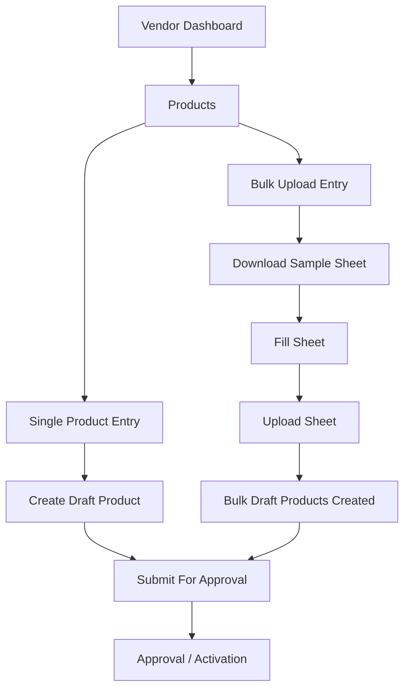

## Service Team Flow

### Service Team Main Responsibilities

- receive service requests from users/customers
- take ownership of requests
- contact customers for missing details
- contact vendors if needed
- record requirement notes
- record vendor notes
- record verification notes
- reply to service token inquiries
- track follow-up status

### Service Team Page Flow

| Page Group | Purpose | Typical Next Step |
|---|---|---|
| Dashboard | Queue summary | Requests queue, tokens queue |
| Service Requests | Manage direct service requests | Take ownership, update notes, update status |
| Service Tokens | Manage marketplace inquiry tokens | Take ownership, update notes, reply to customer |

### Service Request Lifecycle

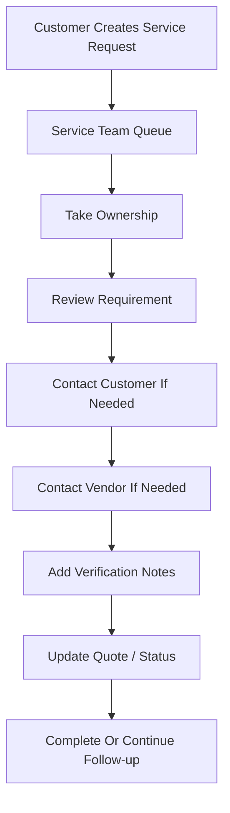

### Service Token Lifecycle

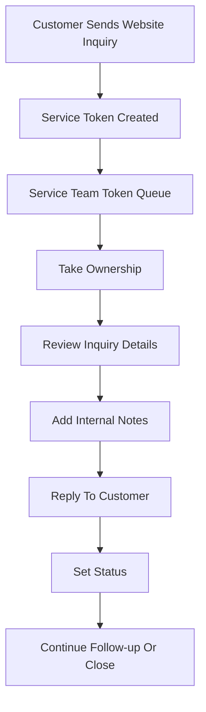

## Cross-Team Business Flows

### Marketplace Product Publishing Flow

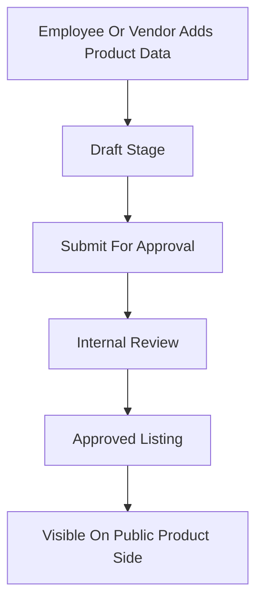

### Support And Inquiry Flow

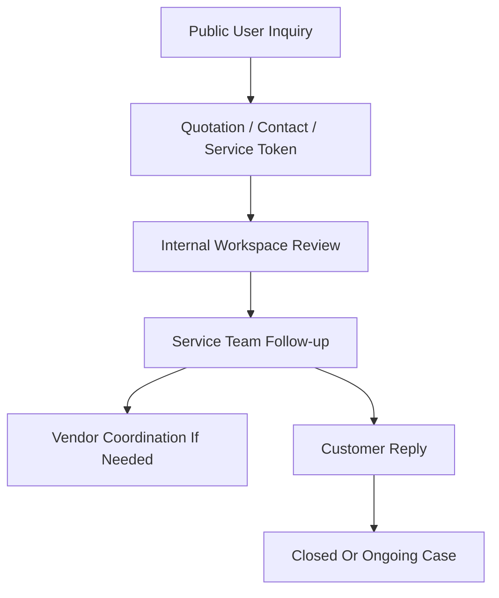

### Internal Role Relationship Flow

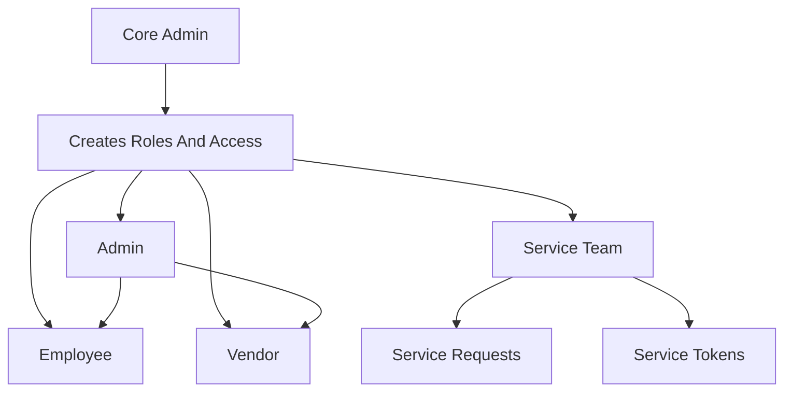

## Suggested Page-Level Flowchart Structure

If you want to build a flowchart for every page, use this simple pattern:

- Entry to page
- Main action options on page
- Decision points
- Save / submit / reply / next step
- Where the user goes after completion

Example pattern:

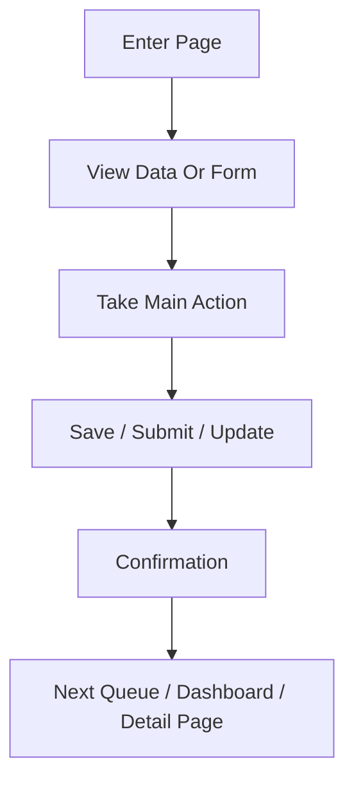

## Summary

Use this document as the non-technical page-flow overview of Electava. It is written so you can convert each section into a more detailed flowchart later without needing code or file details.
