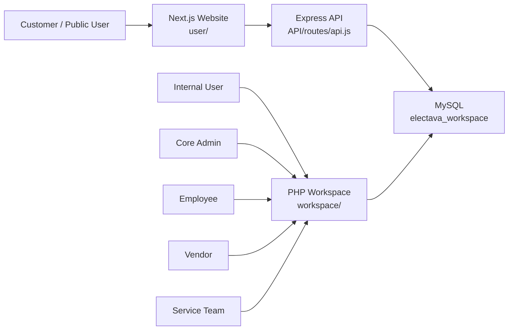
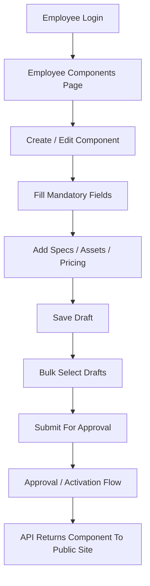
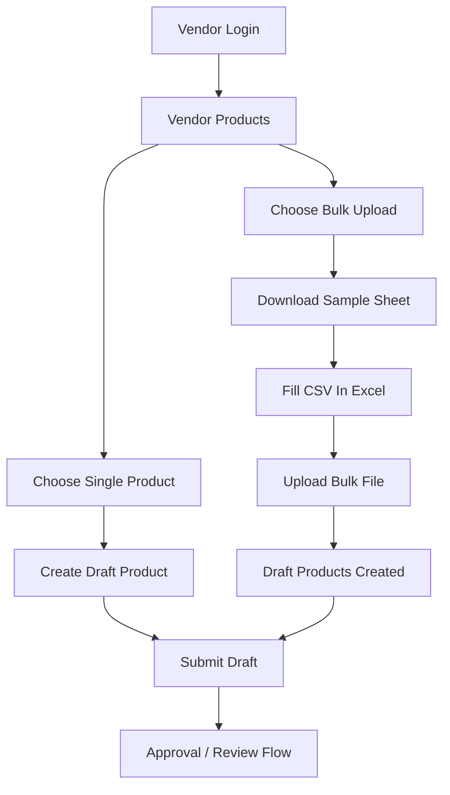
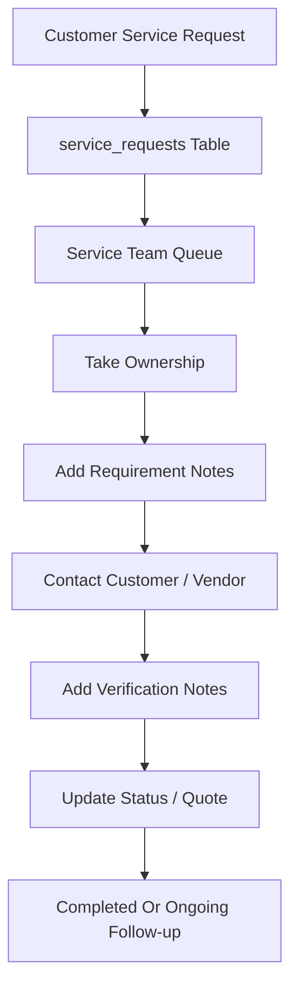
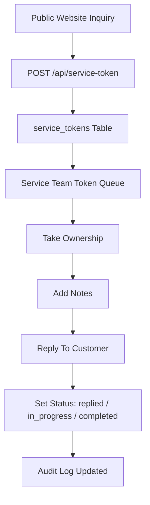

# Electava Project Prompt And Flow

## Purpose

This file is a prompt-style project reference for the Electava repository. It is designed to be easy to reuse when planning changes, onboarding a developer, or giving AI/code agents the right context before edits.

## Master Prompt

```text
You are working inside the Electava monorepo.

This repo has 3 connected layers:
1. user/ -> customer-facing Next.js website
2. API/ -> Node.js/Express API bridge
3. workspace/ -> PHP/MySQL internal operations workspace

Main local URLs:
- Website: http://127.0.0.1:3000
- API: http://127.0.0.1:5000
- Workspace: http://127.0.0.1:8000

Database:
- MySQL database name: electava_workspace

Main business areas:
- public marketplace website
- component catalog and sourcing flows
- quotation/service inquiry flows
- internal employee component creation
- vendor single and bulk product upload
- service-team handling of service requests and service tokens

Important workspace roles:
- core_admin
- admin
- employee
- vendor
- service_team

Important implementation notes:
- shared workspace auth/routing is in workspace/includes/auth.php
- shared workspace layout is in workspace/includes/header.php and footer.php
- marketplace API endpoints are in API/routes/api.js
- employee component workflow is in workspace/employee/components.php
- vendor product workflow is in workspace/vendor/products_page.php
- service-team workflow is in workspace/service_team/

When making changes, preserve the current role-based structure and check whether the change affects:
- public UI
- API response shape
- workspace role permissions
- MySQL schema fields
- local test/run flow
```

## Prompt By Area

### Public Website Prompt

```text
Work on the customer-facing Electava website in user/.

The site is built with Next.js app router and includes public pages for products, manufacturers, search, quotation requests, sell/seller flows, blog, careers, cart, checkout, account, login, register, and contact.

The site may use both local data files and API data from the Node API layer.

When changing website behavior, check:
- user/src/app/
- user/src/components/
- user/src/data/
- API/routes/api.js
```

### API Prompt

```text
Work on the Electava API bridge in API/.

The API reads from MySQL and serves marketplace data to the public website.

Current responsibilities:
- components list/detail
- categories
- manufacturers
- tracking
- service tokens
- careers

When changing API behavior, keep frontend response compatibility in mind, especially for:
- partNumber
- electavaPartNumber
- priceTiers
- assetLinks
- datasheet
- image
```

### Workspace Prompt

```text
Work on the Electava internal workspace in workspace/.

This is a role-based PHP/MySQL system with shared auth and layout files.

Current roles:
- core_admin
- admin
- employee
- vendor
- service_team

When changing workspace behavior, check:
- route access
- shared sidebar/header
- role dashboard mapping
- related SQL schema
- notifications and audit logs when applicable
```

### Service Team Prompt

```text
Work on the service_team role inside workspace/service_team/.

This team handles incoming service requests and marketplace service tokens.

Main duties:
- take ownership of requests/tokens
- contact customers or vendors
- capture requirement notes
- capture vendor notes
- capture verification notes
- update status
- track last-contact time
- reply to service-token inquiries

Database fields used for this workflow include:
- service_requests.assigned_to
- service_requests.requirement_notes
- service_requests.vendor_notes
- service_requests.verification_notes
- service_requests.last_contact_at
- service_tokens.assigned_to
- service_tokens.requirement_notes
- service_tokens.vendor_notes
- service_tokens.verification_notes
- service_tokens.last_contact_at
```

## Key File Map

### Root

| File | Purpose |
|---|---|
| `start-all.bat` | Starts website, API, and workspace locally |
| `README.md` | Short repo overview |
| `SITE_AND_WORKSPACE_DOCUMENTATION.md` | Detailed current implementation notes |
| `PROJECT_PROMPT_AND_FLOW.md` | Prompt-style reference and flowcharts |

### Public Website

| File or Folder | Purpose |
|---|---|
| `user/package.json` | Next.js app scripts and dependencies |
| `user/src/app/` | Public routes |
| `user/src/components/` | Shared website UI components |
| `user/src/data/` | Local content and mock data |
| `user/src/app/products/page.js` | Product listing |
| `user/src/app/products/[id]/page.js` | Product detail |
| `user/src/app/quotation/page.js` | Quotation/service request entry |
| `user/src/app/contact/page.js` | Contact and inquiry page |
| `user/src/app/careers/page.js` | Careers listing |

### API

| File or Folder | Purpose |
|---|---|
| `API/server.js` | API entry server |
| `API/routes/api.js` | Main API routes |
| `API/config/db.js` | MySQL connection setup |
| `API/package.json` | API dependencies |

### Workspace Shared

| File | Purpose |
|---|---|
| `workspace/includes/auth.php` | Login checks, role checks, dashboard routing |
| `workspace/includes/header.php` | Shared workspace sidebar and topbar |
| `workspace/includes/footer.php` | Shared footer and client-side helpers |
| `workspace/login.php` | Internal login screen |
| `workspace/notifications.php` | Shared notifications page |

### Core Admin

| File | Purpose |
|---|---|
| `workspace/core_admin/index.php` | Core admin dashboard |
| `workspace/core_admin/employees.php` | Employee and service-team creation/management |
| `workspace/core_admin/permissions.php` | Module permissions |
| `workspace/core_admin/service_tokens.php` | Core admin service tokens area |
| `workspace/core_admin/users.php` | Marketplace user view |

### Employee

| File | Purpose |
|---|---|
| `workspace/employee/index.php` | Employee dashboard |
| `workspace/employee/components.php` | Component creation/editing/submission flow |
| `workspace/employee/services.php` | Original employee service-request page |
| `workspace/employee/tasks.php` | Employee tasks |
| `workspace/employee/submissions.php` | Submission history |

### Vendor

| File | Purpose |
|---|---|
| `workspace/vendor/index.php` | Vendor dashboard |
| `workspace/vendor/products.php` | Vendor product route entry |
| `workspace/vendor/products_page.php` | Vendor single/bulk product UI and actions |
| `workspace/vendor/product_template.php` | Bulk upload sample sheet download |
| `workspace/vendor/inventory.php` | Vendor stock view |
| `workspace/vendor/orders.php` | Vendor purchase orders |
| `workspace/vendor/profile.php` | Vendor company profile |

### Service Team

| File | Purpose |
|---|---|
| `workspace/service_team/index.php` | Service-team dashboard |
| `workspace/service_team/requests.php` | Service-request queue |
| `workspace/service_team/tokens.php` | Service-token queue and reply flow |

### Database

| File | Purpose |
|---|---|
| `workspace/install.sql` | Main workspace schema and seed data |
| `workspace/tracking.sql` | Tracking and service-token schema |
| `workspace/db_refactor.sql` | Historical role migration reference |

## Flow Charts

### System Architecture



### Component Flow



### Vendor Product Flow



### Service Request Flow



### Service Token Flow



## Quick Prompt For Future Changes

```text
Before editing Electava, identify which layer is affected:
- public website in user/
- API in API/
- internal workspace in workspace/

Then identify which role or workflow is affected:
- core admin
- admin
- employee
- vendor
- service team

Then check whether the change requires updates to:
- PHP page/UI
- API route
- SQL schema
- shared auth/routing
- audit/notification behavior

Use the file map and flow charts in PROJECT_PROMPT_AND_FLOW.md as the first reference.
```

## Edit Note

This file is meant to stay editable. If you change routes, roles, workflows, schemas, or startup steps, update this file so it remains a useful prompt/reference for the next round of work.
