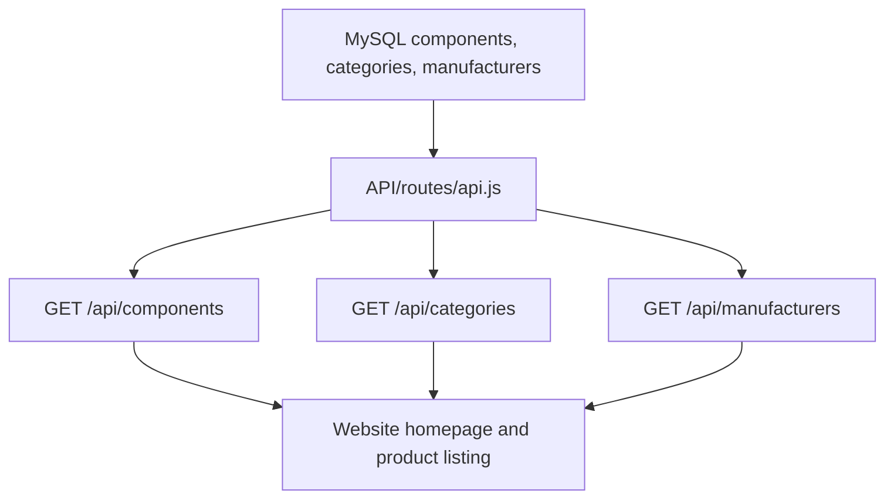
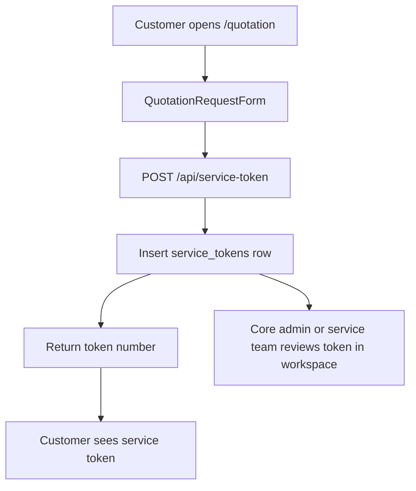
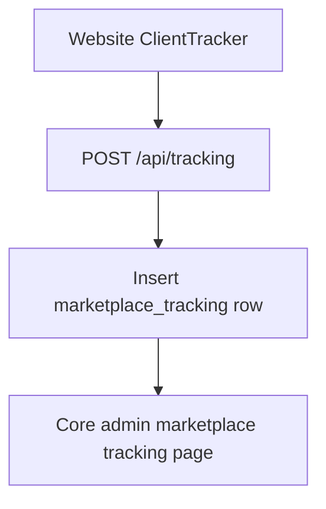
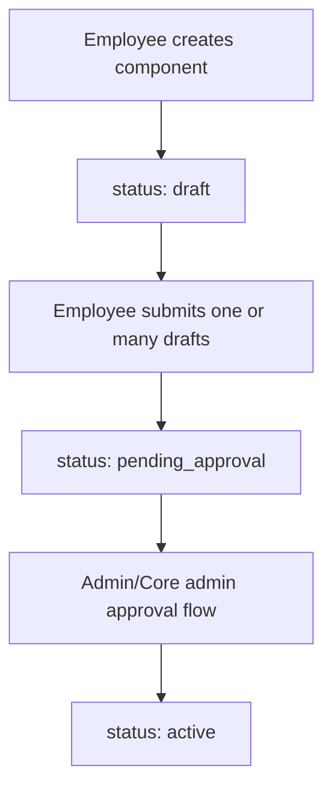

# Electava Deep System Documentation

## 1. Purpose

Electava is a three-part local platform for an electronics component marketplace and internal operations workspace.

The current repository contains:

- a public Next.js marketplace in `user/`
- a Node.js/Express API bridge in `API/`
- a PHP/MySQL internal workspace in `workspace/`
- PowerShell and batch scripts for setup, start, stop, validation, and handoff packaging
- SQL schema files for workspace data, marketplace tracking, service tokens, and careers

This document describes the current implementation only. It intentionally calls out where the product is live, partially wired, or still front-end/demo state.

## 2. Runtime Architecture

### 2.1 Service Map

| Layer | Technology | Local URL | Main Entry | Responsibility |
|---|---|---|---|---|
| Public website | Next.js 16, React 19 | `http://127.0.0.1:3000` | `user/src/app/layout.js`, `user/src/app/page.js` | Customer-facing pages, catalog browsing, cart UI, quotation form, careers, blog, account UI. |
| API bridge | Node.js, Express 5, mysql2 | `http://127.0.0.1:5000` | `API/server.js` | JSON API for catalog, categories, manufacturers, tracking, service tokens, careers. |
| Workspace | PHP 8, PDO, MySQL | `http://127.0.0.1:8000` | `workspace/index.php`, `workspace/login.php` | Role-based internal operations for core admin, admin, employee, vendor, and service team. |
| Database | MySQL/MariaDB | `127.0.0.1:3306` | `workspace/install.sql`, `workspace/tracking.sql` | Persistent data for users, components, tasks, services, vendors, logs, tracking, tokens, careers. |

### 2.2 Local Start Flow

The preferred local start script is:

```powershell
powershell -ExecutionPolicy Bypass -File scripts\start-local.ps1
```

The script:

- creates `runtime-logs/`
- resolves `npm.cmd`
- resolves PHP from `C:\xampp\php\php.exe` or PATH
- optionally starts XAMPP MySQL with `-StartMySql`
- starts API on port `5000`
- starts website on port `3000`
- starts workspace on port `8000`

Root batch wrappers exist for convenience:

- `start-all.bat`
- `setup-local.bat`
- `stop-local.bat`
- `validate-local.bat`
- `package-handoff.bat`

### 2.3 Environment Files

The API uses `API/.env` through `dotenv`.

Important API variables:

| Variable | Default | Purpose |
|---|---|---|
| `PORT` | `5000` | Express listen port. |
| `CORS_ORIGIN` | `*` | Allowed website origins. `*` allows all origins. |
| `DB_HOST` | `127.0.0.1` | MySQL host. |
| `DB_PORT` | `3306` | MySQL port. |
| `DB_USER` | `root` | MySQL user. |
| `DB_PASS` | empty | MySQL password. |
| `DB_NAME` | `electava_workspace` | Database name. |

The website API helper reads:

| Variable | Default | Purpose |
|---|---|---|
| `NEXT_PUBLIC_API_BASE_URL` | `http://127.0.0.1:5000` | Browser-safe API base URL. |
| `API_BASE_URL` | `http://127.0.0.1:5000` | Server-side fallback API base URL. |

The workspace reads `workspace/.env` through `workspace/includes/db.php`.

Important workspace variables:

| Variable | Default | Purpose |
|---|---|---|
| `DB_HOST` | `127.0.0.1` | MySQL host. |
| `DB_PORT` | `3306` | MySQL port. |
| `DB_NAME` | `electava_workspace` | Database name. |
| `DB_USER` | `root` | MySQL user. |
| `DB_PASS` | empty | MySQL password. |
| `DB_CHARSET` | `utf8mb4` | Connection charset. |

## 3. Public Website

### 3.1 Website Structure

The website uses the Next.js app router under `user/src/app/`.

Key folders:

| Path | Purpose |
|---|---|
| `user/src/app/` | Route tree and route-specific CSS. |
| `user/src/components/` | Shared UI components such as header, footer, cards, theme toggle, tracker. |
| `user/src/context/` | Client-side cart and demo marketplace authentication state. |
| `user/src/data/` | Local product, category, blog, and locale datasets. |
| `user/src/lib/api.js` | API base URL helper. |
| `user/public/` | Static public assets used by Next. |

### 3.2 Website Routes

| Route | File | Current Behavior |
|---|---|---|
| `/` | `user/src/app/page.js` | Server component. Fetches API components and categories with `cache: 'no-store'`. Shows hero, category cards, featured products, value cards, manufacturer names, and CTA. |
| `/products` | `user/src/app/products/page.js` | Client component. Fetches components, categories, and manufacturers from the API. Supports filters, sorting, pagination, and grid/list view. |
| `/products/[id]` | `user/src/app/products/[id]/page.js` | Client component. Uses local `user/src/data/products.js`, not the live API. Adds product to cart. |
| `/quotation` | `user/src/app/quotation/page.js` and `QuotationRequestForm.jsx` | Shows service request content and posts quotation form data to `POST /api/service-token`. |
| `/quotations` | `user/src/app/quotations/page.js` | Re-exports quotation page metadata. |
| `/cart` | `user/src/app/cart/page.js` | Client cart page using in-memory React context. |
| `/checkout` | `user/src/app/checkout/page.js` | Front-end checkout UI. Does not persist orders to MySQL. |
| `/login` | `user/src/app/login/page.js` | Demo marketplace login using browser localStorage, not workspace auth. |
| `/register` | `user/src/app/register/page.js` | Demo marketplace registration using browser localStorage. |
| `/account` | `user/src/app/account/page.js` | Demo marketplace account page using localStorage profile. |
| `/forgot-password` | `user/src/app/forgot-password/page.js` | Front-end forgot password form. |
| `/contact` | `user/src/app/contact/page.js` and `ContactInquiryForm.jsx` | Contact page with client-side form state. |
| `/careers` | `user/src/app/careers/page.js` | Fetches active careers from `GET /api/careers`; includes an application form UI. |
| `/sell` | `user/src/app/sell/page.js` | Informational vendor/seller page. Does not create vendor accounts. |
| `/manufacturers` | `user/src/app/manufacturers/page.jsx` | Manufacturer-oriented public page. |
| `/resources` | `user/src/app/resources/page.jsx` | Static resources page. |
| `/search` | `user/src/app/search/page.js` | Client search page using local product data. |
| `/blog` | `user/src/app/blog/page.js` | Blog listing from `user/src/data/blogPosts.js`. |
| `/blog/[slug]` | `user/src/app/blog/[slug]/page.js` | Blog detail from local blog data. |
| `/about` | `user/src/app/about/page.js` | Static company/about page. |

### 3.3 Website Data Sources

| Feature | Data Source | Notes |
|---|---|---|
| Homepage featured products | API `GET /api/components` | Live database-backed API. |
| Homepage categories | API `GET /api/categories` | Live database-backed API. |
| Product listing | API `GET /api/components`, `/api/categories`, `/api/manufacturers` | Live database-backed API. |
| Product detail | `user/src/data/products.js` | Local static dataset. This can diverge from listing results. |
| Cart | `CartContext` in memory | Cart resets on reload because it is not persisted. |
| Marketplace login/register/account | `MarketplaceAuthContext` and localStorage | Demo auth only. Not connected to workspace users. |
| Quotation request | API `POST /api/service-token` | Creates a service token record. |
| Careers | API `GET /api/careers` | Reads active careers from MySQL. |
| Blog | `user/src/data/blogPosts.js` | Local static content. |
| Search | `user/src/data/products.js` | Local static data. |

### 3.4 Website State Management

`CartContext` exposes:

- `items`
- `addItem(product, quantity)`
- `removeItem(productId)`
- `updateQuantity(productId, quantity)`
- `clearCart()`
- `getItemCount()`
- `getSubtotal()`
- `getTotal()`

The cart currently:

- stores items in React state only
- calculates best pricing tier by quantity
- uses fixed tax rate of `8%`
- uses free shipping above subtotal `50`, otherwise `7.99`

`MarketplaceAuthContext` exposes:

- `user`
- `isReady`
- `isAuthenticated`
- `signIn(profile)`
- `registerUser(profile)`
- `updateProfile(patch)`
- `signOut()`

Marketplace auth currently:

- stores a profile in browser localStorage key `electava-marketplace-user`
- is separate from the PHP workspace authentication system
- does not call the API or database

### 3.5 Website/API Helper

`user/src/lib/api.js` exports:

- `getApiBaseUrl()`
- `getApiUrl(path = '')`

The helper removes trailing slashes from the configured base URL and ensures endpoint paths start with `/api`.

Examples:

| Input | Output |
|---|---|
| `getApiUrl('/components')` | `http://127.0.0.1:5000/api/components` |
| `getApiUrl('careers')` | `http://127.0.0.1:5000/api/careers` |
| `getApiUrl('/api/components')` | `http://127.0.0.1:5000/api/components` |

## 4. API Bridge

### 4.1 API Entry Point

`API/server.js`:

- creates an Express app
- disables `x-powered-by`
- enables CORS
- enables JSON request body parsing
- mounts routes at `/api`
- exposes root JSON response at `/`
- exposes health JSON response at `/health`
- starts on `process.env.PORT || 5000`

### 4.2 Database Pool

`API/config/db.js` creates a mysql2 promise pool with:

- `waitForConnections: true`
- `connectionLimit: 10`
- `queueLimit: 0`
- `connectTimeout: 2000`

The short connect timeout is intentional: API requests fail quickly if MySQL is down.

### 4.3 API Endpoints

| Method | Path | Request | Response | Current Purpose |
|---|---|---|---|---|
| `GET` | `/` | none | `{ message }` | Confirms API process is running. |
| `GET` | `/health` | none | `{ ok, service, port }` | Health check. |
| `GET` | `/api/components` | none | Array of mapped components | Public catalog list. |
| `GET` | `/api/components/:id` | path id, supports `prod-001` format | One mapped component or `404` | Public catalog detail by database id. |
| `GET` | `/api/categories` | none | Parent category array with subcategories | Public category navigation and filters. |
| `GET` | `/api/manufacturers` | none | Raw manufacturer rows | Public manufacturer filter list. |
| `POST` | `/api/tracking` | `{ sessionId, deviceType, browser, pageVisited }` | `{ success: true }` | Client page visit tracking. |
| `POST` | `/api/service-token` | `{ userEmail, serviceType, details }` | `{ success: true, token }` | Quotation/service token creation. |
| `GET` | `/api/careers` | none | Active career array | Careers page content. |

### 4.4 Component Response Shape

`API/routes/api.js` maps database rows to the shape expected by the website.

Returned component fields:

| Field | Source | Notes |
|---|---|---|
| `id` | database `components.id` | Returned as `prod-` plus zero-padded id, for example `prod-001`. |
| `db_id` | database `components.id` | Raw numeric id. |
| `name` | `components.name` | Product display name. |
| `manufacturer` | `manufacturers.name` | Defaults to `Unknown`. |
| `partNumber` | `components.part_number` | Manufacturer or vendor part number. |
| `electavaPartNumber` | `components.electava_part_number` or `part_number` | Electava-specific part number fallback. |
| `category` | parent category slug | Lowercase and space-to-hyphen. Defaults to `general`. |
| `subcategory` | category slug | Lowercase and space-to-hyphen. Defaults to `general`. |
| `description` | `components.description` | Long text. |
| `price` | `components.price` | Parsed as number. |
| `priceTiers` | `components.quantity_breaks` | JSON parsed. Falls back to one tier using `price`. |
| `stock` | `components.stock` | Numeric stock. |
| `specs` | `components.specifications` | JSON parsed object. |
| `assetLinks` | `components.asset_links` | JSON parsed object with `documents`, `images`, `cad`. |
| `image` | `components.image_url` | Defaults to `/images/ic.svg`. |
| `datasheet` | `components.datasheet_url` | Defaults to `#`. |

### 4.5 Current API Boundaries

Current API limitations to remember:

- `/api/components` includes records where status is `active`, `draft`, or `NULL`.
- There is no authentication layer on the API endpoints.
- Service token numbers use a hardcoded `SRV-2026-` prefix.
- The careers application form UI is not wired to a persistence endpoint.
- Checkout does not call an API endpoint and does not create purchase orders.

## 5. PHP Workspace

### 5.1 Workspace Structure

| Path | Purpose |
|---|---|
| `workspace/includes/db.php` | Loads env, creates PDO connection, initializes database if missing, normalizes `employees` schema. |
| `workspace/includes/auth.php` | Session helpers, role gates, dashboard routing, audit logs, login logs, notifications, badges, domain access helper. |
| `workspace/includes/header.php` | Shared layout shell, sidebar, user-facing navigation. |
| `workspace/includes/footer.php` | Shared footer scripts, toast helper, confirm helper, API helper. |
| `workspace/login.php` | Shared workspace login form. |
| `workspace/logout.php` | Session termination. |
| `workspace/index.php` | Workspace entry/redirect behavior. |
| `workspace/notifications.php` | Notifications UI. |

### 5.2 Workspace Roles

| Role | Dashboard | Main Folder | Current Responsibilities |
|---|---|---|---|
| `core_admin` | `/core_admin/` | `workspace/core_admin/` | Employee management, domains, permissions, settings, reports, logs, sessions, marketplace users, tracking, service tokens, careers, projects, templates. |
| `admin` | `/admin/` | `workspace/admin/` | Admin dashboard, team management, tasks, approvals, reports, vendors. |
| `employee` | `/employee/` | `workspace/employee/` | Component creation and drafts, task work, submissions, service work, profile, login time visibility. |
| `vendor` | `/vendor/` | `workspace/vendor/` | Vendor dashboard, products, inventory, orders, profile, CSV product template. |
| `service_team` | `/service_team/` | `workspace/service_team/` | Service requests, service tokens, ownership, notes, status updates, replies. |

### 5.3 Authentication Flow

The workspace login flow is:

1. User opens `workspace/login.php`.
2. If already logged in, the user is redirected by role through `getDashboardUrl()`.
3. POST login accepts only the Core Admin-created Employee ID.
4. The code queries `employees`.
5. Password is verified with `password_verify`.
6. Inactive accounts are blocked.
7. Successful login sets session fields:
   - `user_id`
   - `username` as the Employee ID
   - `email`
   - `full_name`
   - `role`
   - `domain_id`
   - `allowed_domains`
8. Successful login updates `last_login_at`.
9. Login and audit events are recorded.
10. User redirects to the role dashboard.

All protected workspace pages call `requireRole(...)`.

### 5.4 Shared Workspace Helpers

`workspace/includes/auth.php` contains:

| Function | Purpose |
|---|---|
| `isLoggedIn()` | Checks `$_SESSION['user_id']`. |
| `requireLogin()` | Redirects anonymous users to `/login.php`. |
| `requireRole($roles)` | Requires login and one of the allowed roles. |
| `getDashboardUrl($role)` | Maps role to dashboard folder. |
| `currentUser()` | Returns a normalized current session user array. |
| `logAudit(...)` | Inserts into `audit_logs`. |
| `logLogin(...)` | Inserts into `login_logs` with device and browser detection. |
| `notify(...)` | Inserts a notification row. |
| `getUnreadNotificationCount(...)` | Counts unread notifications. |
| `timeAgo(...)` | Human-readable relative time. |
| `statusBadge(...)` | Returns Tailwind-compatible status badge HTML. |
| `priorityBadge(...)` | Returns Tailwind-compatible priority badge HTML. |
| `hasDomainAccess($domainId)` | Checks core admin, primary domain, or allowed domains. |

### 5.5 Database Bootstrap And Schema Normalization

`workspace/includes/db.php` does more than connect to MySQL.

It:

- reads `workspace/.env`
- creates a PDO connection
- creates the database if missing
- runs `workspace/install.sql` if the database did not exist
- calls `ensureWorkspaceSchema($pdo)`

`ensureWorkspaceSchema` handles the historical split between `users` and `employees`.

Current normalization behavior:

- renames `users` to `employees` if `employees` is missing and `users` exists
- renames `password_hash` to `password` when needed
- ensures `is_active`, `allowed_domains`, `job_title`, `notes`, `created_by`, `last_login_at`, and `updated_at`
- migrates old roles `core` to `core_admin` and `sub_core` to `admin`
- restricts role enum to `core_admin`, `admin`, `service_team`, `employee`, `vendor`

This means the SQL file may mention `users`, while the live application expects `employees` after bootstrap.

## 6. Core Business Flows

### 6.1 Public Catalog Flow



Important boundary:

- `/products` uses live API data.
- `/products/[id]` uses local static product data.

### 6.2 Quotation/Service Token Flow



Persisted table:

- `service_tokens` from `workspace/tracking.sql`

Current token fields include:

- `token_number`
- `user_email`
- `service_type`
- `details`
- `status`
- `assigned_to`
- `internal_notes`
- `requirement_notes`
- `vendor_notes`
- `verification_notes`
- `last_contact_at`

### 6.3 Marketplace Tracking Flow



Tracking records include:

- session id
- IP address
- user agent
- device type
- browser
- visited page
- created timestamp

### 6.4 Employee Component Creation Flow

The employee component flow is centered in `workspace/employee/components.php`.

It supports:

- creating component drafts
- editing existing component drafts
- submitting drafts for approval
- bulk submit
- adding manufacturers and categories from the form
- quantity pricing rows
- specifications
- document/image/CAD links
- file uploads
- uploaded asset preview and deletion

Typical state flow:



### 6.5 Vendor Product Flow

The vendor product workflow is centered in `workspace/vendor/products_page.php`.

It supports:

- single product entry
- CSV bulk upload
- sample CSV template through `workspace/vendor/product_template.php`
- manufacturer lookup/create
- category lookup/create
- component row creation connected to vendor user

Vendor-created component fields include:

- part number
- product name
- description
- manufacturer
- category
- price
- stock
- datasheet URL
- status

### 6.6 Task And Approval Flow

Task-related workspace areas:

- `workspace/admin/tasks.php`
- `workspace/admin/approvals.php`
- `workspace/employee/tasks.php`
- `workspace/employee/submissions.php`
- `workspace/api/tasks.php`
- `workspace/api/approvals.php`

The database tables are:

- `tasks`
- `task_approvals`
- `task_templates`

Common task statuses:

- `pending`
- `in_progress`
- `submitted`
- `approved`
- `rejected`
- `completed`

## 7. Database Model

### 7.1 Main Schema Files

| File | Purpose |
|---|---|
| `workspace/install.sql` | Main workspace schema and seeded workspace data. |
| `workspace/tracking.sql` | Marketplace tracking, service tokens, and careers tables. |
| `workspace/db_refactor.sql` | Additional/refactor SQL file for customer-oriented tables. |
| `workspace/fix_password.sql` | Password-related fix script. |
| `workspace/db_fix.php`, `workspace/final_db_fix.php` | Database repair helper scripts. |

### 7.2 Main Tables

| Table | Purpose |
|---|---|
| `employees` | Live internal account table after bootstrap normalization. |
| `domains` | Workspace domains/access grouping. |
| `projects` | Project management records. |
| `task_templates` | Reusable task definitions. |
| `tasks` | Assigned tasks. |
| `task_approvals` | Task approval/rejection records. |
| `categories` | Marketplace category hierarchy. |
| `manufacturers` | Manufacturer records. |
| `components` | Catalog/product/component records. |
| `service_requests` | PCB/service request records. |
| `vendors` | Vendor profiles connected to users/employees. |
| `purchase_orders` | Vendor purchase orders. |
| `files` | Uploaded file metadata. |
| `notifications` | Workspace notifications. |
| `audit_logs` | Workspace audit trail. |
| `login_logs` | Workspace login/attendance trail. |
| `modules` | Permission module definitions. |
| `module_permissions` | Role/domain permissions. |
| `system_settings` | Configurable workspace settings. |
| `approval_rules` | Approval policy records. |
| `marketplace_tracking` | Public website tracking events. |
| `service_tokens` | Public quotation/service token records. |
| `careers` | Public careers page content. |

### 7.3 Component Table

`components` is the central catalog table.

Important columns:

| Column | Purpose |
|---|---|
| `part_number` | Source/manufacturer/vendor part number. |
| `electava_part_number` | Electava-specific part number. |
| `name` | Product/component name. |
| `description` | Product description. |
| `manufacturer_id` | Link to `manufacturers`. |
| `category_id` | Link to `categories`. |
| `vendor_id` | Vendor owner/reference when vendor-created. |
| `price` | Base unit price. |
| `quantity_breaks` | JSON/text quantity price tiers. |
| `stock` | Current stock count. |
| `low_stock_threshold` | Threshold for inventory warnings. |
| `status` | Draft/approval/active lifecycle. |
| `datasheet_url` | Datasheet link. |
| `symbol_file`, `footprint_file`, `step_file` | EDA/CAD file paths or links. |
| `image_url` | Product image URL. |
| `specifications` | JSON specification object. |
| `asset_links` | JSON link groups for documents, images, and CAD. |
| `created_by`, `approved_by` | Internal user references. |

## 8. Validation And Operations

### 8.1 Validation Script

Use:

```powershell
powershell -ExecutionPolicy Bypass -File scripts\validate-local.ps1
```

The root wrapper is:

```powershell
validate-local.bat
```

The validation script should be used after code or schema changes to catch syntax and smoke-test problems.

### 8.2 Stop Script

Use:

```powershell
powershell -ExecutionPolicy Bypass -File scripts\stop-local.ps1
```

The root wrapper is:

```powershell
stop-local.bat
```

### 8.3 Logs

Runtime logs are stored in:

- `runtime-logs/api.log`
- `runtime-logs/website.log`
- `runtime-logs/workspace.log`

Additional direct-launch logs may exist:

- `runtime-logs/api.out.log`
- `runtime-logs/api.err.log`
- `runtime-logs/website.out.log`
- `runtime-logs/website.err.log`
- `runtime-logs/workspace.out.log`
- `runtime-logs/workspace.err.log`

Longer-lived local logs may also appear in:

- `logs/api.log`
- `logs/user-dev.log`
- `logs/mysql.log`
- `logs/mysql-error.log`

## 9. Current Implementation Boundaries

The following are current-state facts, not necessarily desired final behavior.

| Area | Current Boundary |
|---|---|
| Product detail | Uses local `user/src/data/products.js`, while product listing uses API data. |
| Checkout | Front-end only. It does not create purchase orders. |
| Marketplace auth | Demo localStorage auth only. It is separate from workspace auth. |
| Vendor onboarding | Public `sell` page is informational. Vendor accounts are created internally. |
| Service quotation | Public quotation creates service tokens, not full service requests. |
| API auth | Public API endpoints are unauthenticated. |
| API component listing | Includes `draft` components as well as `active` and `NULL` status components. |
| Careers application | Careers list is database-backed, but application submission is UI-only unless extended. |
| SQL naming | `install.sql` creates `users`, while runtime normalizes to `employees`. |

## 10. Change Checklist

Before changing website behavior:

- identify whether the page uses API data or local data
- check `user/src/lib/api.js` for endpoint construction
- check whether the route is a server component or client component
- check context dependencies such as cart or marketplace auth
- test desktop and mobile layouts when UI changes

Before changing API behavior:

- check `API/routes/api.js`
- preserve response shape fields consumed by the website
- check MySQL table and column names
- check error response shape
- run the API syntax check from `API/package.json`

Before changing workspace behavior:

- check the top-level `requireRole(...)`
- check session fields used by the page
- check relevant schema in `install.sql` or `tracking.sql`
- add audit logs or notifications when the change affects user operations
- test with the relevant role account

Before changing database behavior:

- update SQL schema files
- check `ensureWorkspaceSchema` if runtime migration is needed
- verify API queries
- verify workspace PDO queries
- verify seeded/default accounts if role or user tables change
